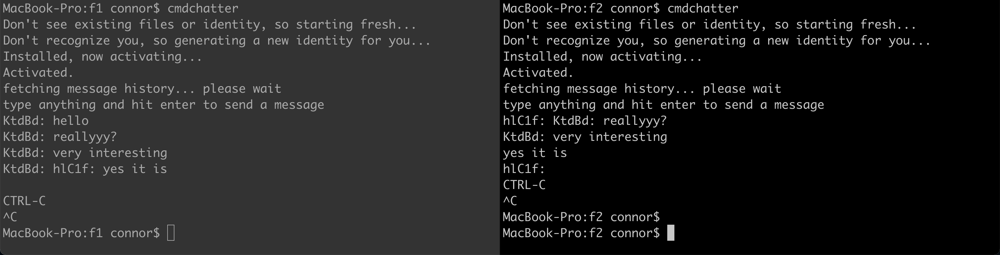

# cmdchatter
a prototype cmd line chat app, using holochain, written in Rust



## Installing and running

> Prereq: have a [stable version of rust](https://www.rust-lang.org/tools/install) installed

### Installing
```bash
cargo install --git https://github.com/holochain/lair
cargo install --git https://github.com/Sprillow/cmdchatter
```

### Running
```bash
cd /a/directory/to/install/persist/and/run/cmdchatter
RUST_LOG=none cmdchatter
```

> If you don't set RUST_LOG=none you will get a flood of irrelevant holochain networking error logs

Press Ctrl-C twice to quit.

The first time you run it, it will create a folder called `databases` *inside* of the folder from which you started the command, if it can. If that folder gets deleted, so does any data that has not been gossiped to peers, along with the ability to easily continue using the identity that you were previously using.

Next time you want to use it, make sure you `cd` into the same directory
as you initialized in, otherwise a new identity will be issued and new `databases` folder created.